# Facet

A multi-dimensional photo analysis engine that examines every facet of an image — from aesthetic appeal and composition to facial detail and technical precision — using an ensemble of vision models to surface the photos that truly shine.


<p align="center">
  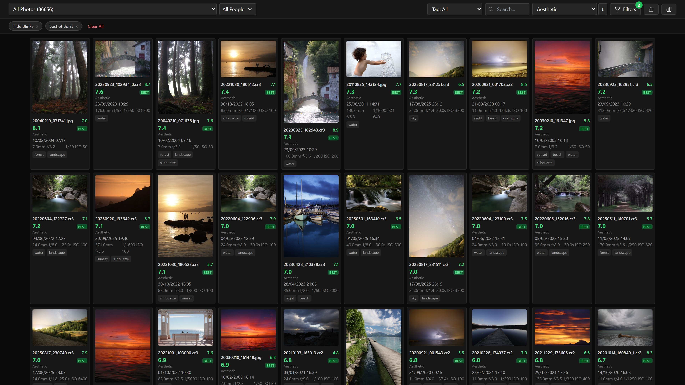
</p>

## Features

### Smart Photo Gallery


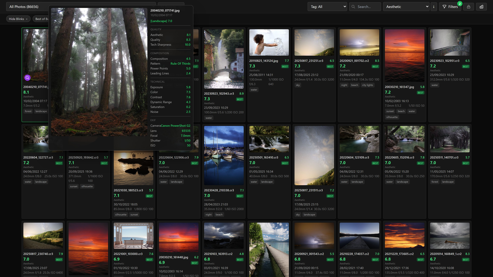

Dark-themed web gallery with infinite scroll, 24 sort options across 6 groups, 30 content categories, and responsive mobile layout. Hover any photo for a detailed score breakdown with EXIF data, per-metric scores, and composition patterns.

### Top Picks

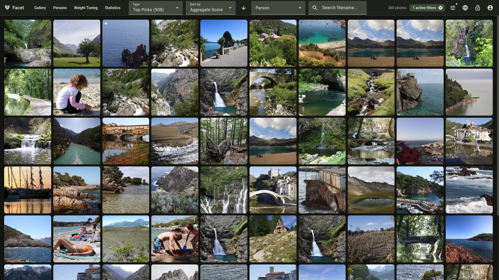

Curated selection using a custom weighted score (aesthetic, composition, face quality). Configurable minimum score threshold and face ratio to surface the best photos across the entire library.

### AI-Powered Quality Scoring

Scores every photo using [TOPIQ](https://github.com/chaofengc/IQA-PyTorch) (0.93 SRCC on KonIQ-10k), the leading no-reference image quality model. Alternative models (HyperIQA, DBCNN, MUSIQ) available via configuration.

- **Aesthetic quality** — TOPIQ with ResNet50 backbone
- **Composition analysis** — SAMP-Net detecting 14 patterns (rule of thirds, golden ratio, vanishing point, diagonal, symmetric, and more)
- **Semantic tagging** — CLIP ViT-L-14, Qwen3-VL-2B, or Qwen2.5-VL-7B (configurable per VRAM profile)
- **Technical metrics** — sharpness, noise, exposure, color harmony, dynamic range, contrast, isolation
- **30 content categories** with specialized scoring weights (landscape, portrait, architecture, macro, astro, concert, wildlife, street, and more)

### Face Recognition & Person Management

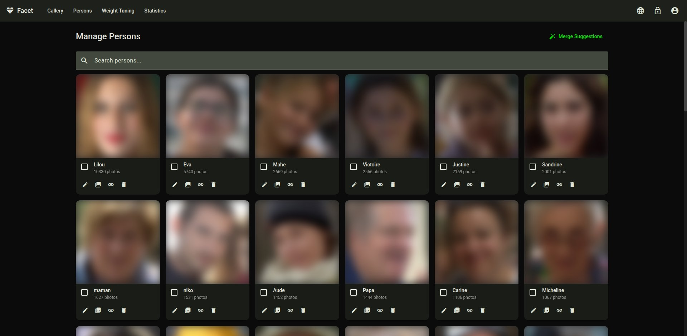
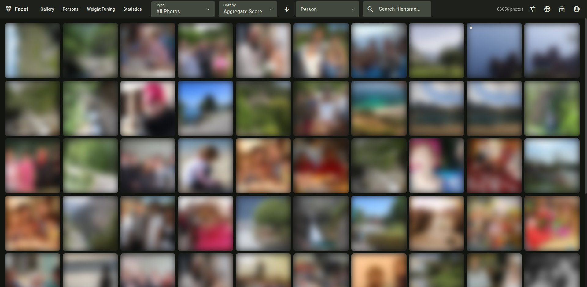

Automatic face detection via InsightFace with 106-point landmarks, HDBSCAN clustering into persons, blink detection (EAR-based), and a management UI for merging, renaming, and organizing person clusters. Supports GPU-accelerated clustering via cuML for large libraries.

### Advanced Filtering

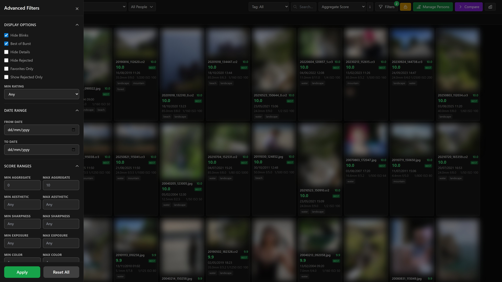

Filter drawer with 50+ options organized in collapsible sections: display toggles (blinks, bursts, details, favorites, rejected), star rating, date range, score ranges (aggregate, aesthetic, sharpness, exposure, color, composition), composition pattern, face metrics (count, quality, eye sharpness, ratio, face sharpness), image metrics (dynamic range, contrast, noise, isolation, luminance, histogram spread, power point), and camera settings (camera, lens, ISO, f-stop, focal length). Active filters shown as removable chips.

### Statistics & Analytics

<table><tr>
<td>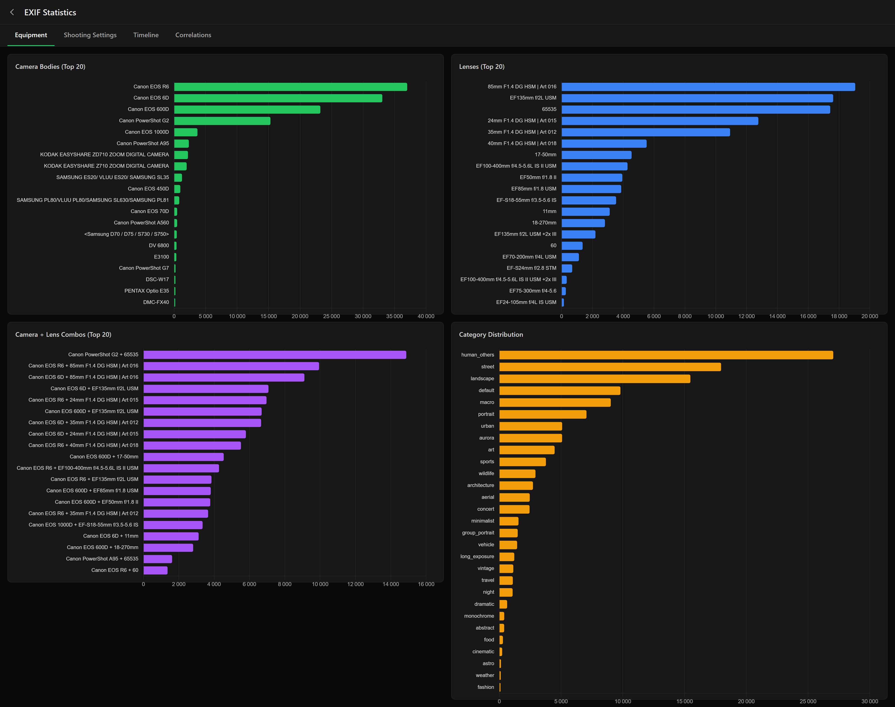</td>
<td>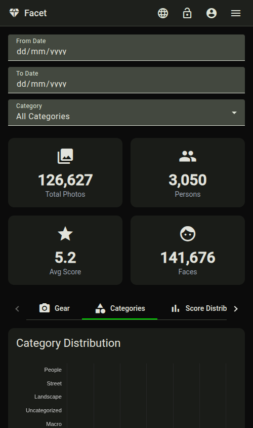</td>
</tr><tr>
<td>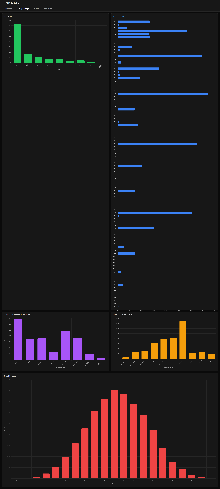</td>
<td>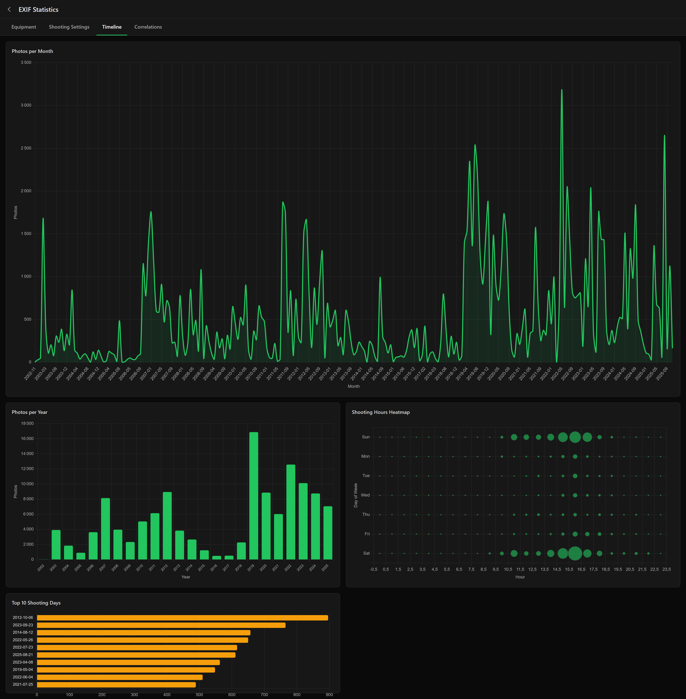</td>
</tr><tr>
<td colspan="2">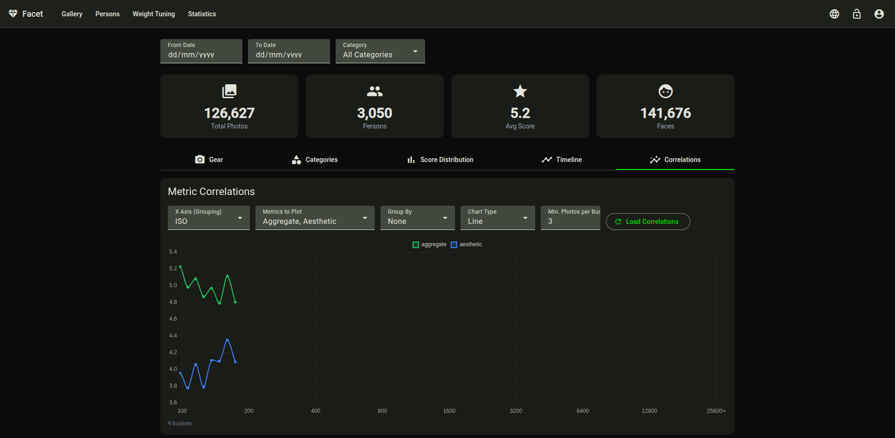</td>
</tr></table>

Interactive dashboards with five tabs: gear usage (cameras, lenses, body+lens combos), category analytics (breakdown, weights, correlations, overlap), score distribution (ISO, aperture, focal length, shutter speed), timeline heatmaps, and configurable correlation charts.

### Weight Tuning

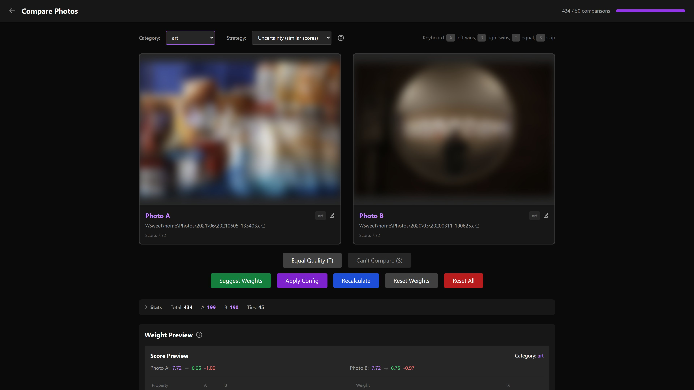

Per-category weight editor with live preview of top-scored photos. Side-by-side pairwise comparison with keyboard shortcuts and four selection strategies (uncertainty, boundary, active learning, random). The system learns from your choices and suggests per-category weight adjustments with prediction accuracy tracking.

### Mobile Responsive


Full-width cards on mobile with touch-friendly controls. Desktop shows detailed photo info, EXIF data, tag links, person avatars, and hover previews with score breakdowns.

## Quick Start

```bash
# Install Python dependencies
python -m venv venv && source venv/bin/activate
pip install -r requirements.txt

# Install Angular frontend
cd client && npm install && npx ng build && cd ..

# Score photos (auto-detects VRAM, uses multi-pass mode)
python photos.py /path/to/photos

# Run the web viewer (FastAPI API + Angular SPA)
python run_api.py
# Open http://localhost:8000
```

VRAM is auto-detected at startup. Use `--single-pass` to keep all models loaded simultaneously on high-VRAM systems, or `--pass quality|tags|composition` to run a specific pass.

## VRAM Profiles

| Profile | GPU VRAM | Models | Best For |
|---------|----------|--------|----------|
| `auto` | Any | Auto-selected | **Default** — detects VRAM, picks best profile |
| `legacy` | 2-4 GB | CLIP+MLP + SAMP-Net | Fast scanning, limited hardware |
| `8gb` | 4-8 GB | CLIP+MLP + SAMP-Net + Qwen3-VL | Better tagging, mid-range GPUs |
| `16gb` | 16 GB+ | TOPIQ + SAMP-Net + Qwen3-VL | Best aesthetic accuracy |
| `24gb` | 24 GB+ | TOPIQ + Qwen2-VL + Qwen2.5-VL-7B | Best accuracy + VLM tagging |

TOPIQ (0.93 SRCC on KonIQ-10k) is the primary quality model for 16gb/24gb profiles. Lower profiles use CLIP+MLP (0.76 SRCC) with an upgrade path as hardware allows.

## Documentation

| Document | Description |
|----------|-------------|
| [Installation](docs/INSTALLATION.md) | Requirements, GPU setup, dependencies |
| [Commands](docs/COMMANDS.md) | All CLI commands reference |
| [Configuration](docs/CONFIGURATION.md) | Full `scoring_config.json` reference |
| [Scoring](docs/SCORING.md) | Categories, weights, tuning guide |
| [Face Recognition](docs/FACE_RECOGNITION.md) | Face workflow, clustering, person management |
| [Viewer](docs/VIEWER.md) | Web gallery features and usage |
| [Deployment](docs/DEPLOYMENT.md) | Production deployment (Synology NAS, Linux, Docker) |

## Supported File Types

- **JPEG** (.jpg, .jpeg)
- **Canon RAW** (.cr2, .cr3) — skipped if matching JPEG exists

## Troubleshooting

| Issue | Solution |
|-------|----------|
| "externally-managed-environment" | Use virtual environment |
| Slow processing | Check VRAM profile, use `--single-pass` for high-VRAM systems |
| Face detection not using GPU | Install `onnxruntime-gpu` |
| Missing exiftool | Install via system package manager |

See [Installation](docs/INSTALLATION.md) for detailed setup instructions.
